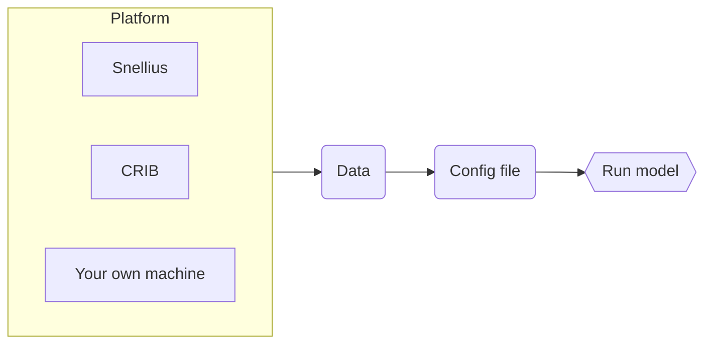

# STEMMUS_SCOPE

`STEMMUS_SCOPE` serves as an integrated code of SCOPE and STEMMUS.

SCOPE is a radiative transfer and energy balance model, and STEMMUS model is a two-phase mass and heat transfer model. For more information about the coupling between these two models, please check [this reference](https://gmd.copernicus.org/articles/14/1379/2021/).

(by Zeng & Su, 2021)

## Running STEMMUS_SCOPE

About how to run `STEMMUS_SCOPE` on Snellius, check [this document](./docs/STEMMUS_SCOPE_on_Snellius.md).

If you want to run `STEMMUS_SCOPE` on CRIB, check [this document](./docs/STEMMUS_SCOPE_on_CRIB.md).

If you want to run `STEMMUS_SCOPE` on your own machine, check [this document](./docs/STEMMUS_SCOPE_on_local_device.md).

## Contributing

If you want to contribute to the development of `STEMMUS_SCOPE`,
have a look at the [contribution guidelines](CONTRIBUTING.md).

## How to cite us

<!--  -->

<!--TODO: add links to zenodo. -->
More information will follow soon.
