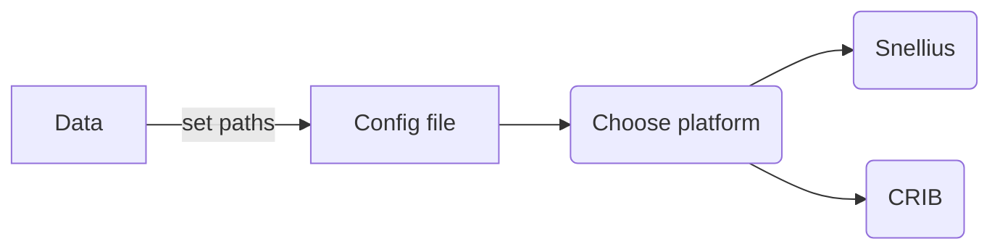

# STEMMUS_SCOPE

Integrated code of SCOPE and STEMMUS.

<!-- TO DO: Briefly introduce STEMMUS_SCOPE -->

## Running STEMMUS_SCOPE

## Create an executable file of STEMMUS_SCOPE

See the [exe readme](./exe/README.md).

## Preparing the outputs of the model in NetCDF:

There is some files in utils directory in this repository. The utils are used to
read `.csv` files and save them in `.nc` format. See [utils
readme](./utils/csv_to_nc/README.md).

> An example NetCDF file is stored in the project directory to show the desired
  structure of variables in one file.

## Documentation

More information will follow soon.

## Contributing

If you want to contribute to the development of `STEMMUS_SCOPE`,
have a look at the [contribution guidelines](CONTRIBUTING.md).

## How to cite us

<!--  -->

<!--TODO: add links to zenodo. -->
More information will follow soon.