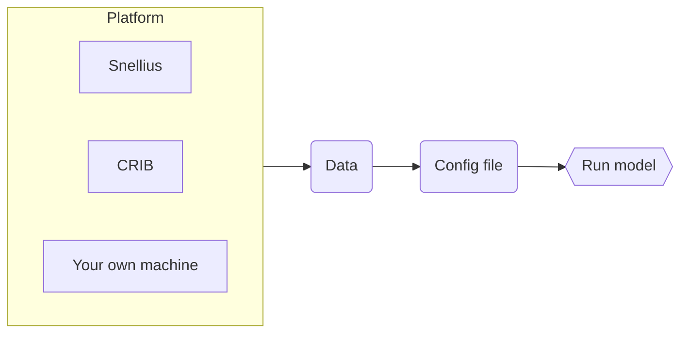

# STEMMUS_SCOPE

Integrated code of SCOPE and STEMMUS.

SCOPE is a radiative transfer and energy balance model, and STEMMUS model is a two-phase mass and heat transfer model. For more information about the coupling between these two models, please check [this reference](https://gmd.copernicus.org/articles/14/1379/2021/). Before running the model, you need to prepare input data and a configuration file. This can be done using the python package
[PyStemmusScope](https://pystemmusscope.readthedocs.io).  

(by Zeng & Su, 2021)

## Running STEMMUS_SCOPE

About how to run `STEMMUS_SCOPE` on Snellius, check [./docs/STEMMUS_SCOPE_on_Snellius.md](https://github.com/EcoExtreML/STEMMUS_SCOPE/blob/main/docs/STEMMUS_SCOPE_on_Snellius.md).

If you want to run `STEMMUS_SCOPE` on CRIB, check [./docs/STEMMUS_SCOPE_on_CRIB.md](https://github.com/EcoExtreML/STEMMUS_SCOPE/blob/main/docs/STEMMUS_SCOPE_on_CRIB.md).

If you want to run `STEMMUS_SCOPE` on your own machine, check [./docs/STEMMUS_SCOPE_on_local_device.md](https://github.com/EcoExtreML/STEMMUS_SCOPE/blob/main/docs/STEMMUS_SCOPE_on_local_device.md).

`STEMMUS_SCOPE` scope also has a Basic Model Interface (BMI) mode implemented. The full BMI is implemented in Python in [PyStemmusScope](https://github.com/EcoExtreML/STEMMUS_SCOPE_Processing/). For more information, check [./docs/STEMMUS_SCOPE_BMI.md](https://github.com/EcoExtreML/STEMMUS_SCOPE/blob/main/docs/STEMMUS_SCOPE_BMI.md).

## Contributing

If you want to contribute to the development of `STEMMUS_SCOPE`,
have a look at the [contribution guidelines](https://github.com/EcoExtreML/STEMMUS_SCOPE/blob/main/CONTRIBUTING.md).

## How to cite us

<!--  -->
